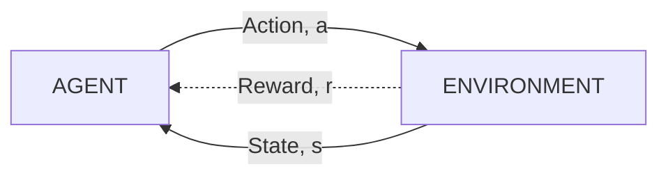

# Reinforcement Learning

---

`CODE`: `[My RL repo](https://github.com/biswajitpawl/reinforcement-learning)`

### What is Reinforcement Learning?

`UAlberta`

- [week 1] Sequential decision making with evaluative feedback
- [week 3] Problem formulation for sequential decision making under uncertainty
- `GOAL`: To maximize future rewards (in expectation) (check Reward Hypothesis)

### How is it different from supervised learning?

`UAlberta`

- Agent generates its own data by interacting with the world (environment). [Data is not given to the model]
- Agent learns consequence of its own actions through trial and error (evaluation) rather than being told the correct action. [In SL, we provide data with correct labels/answers]

`[Lex](https://youtu.be/zR11FLZ-O9M)`

- `SL` teaching/learning by example, `RL`: teaching/learning by experience

### How is related to (and different from) Control Theory?

`Steve Brunton`

- RL is at the sweet-spot between Control Theory and Machine Learning.
- RL is a branch of ML which essentially deals with how to **learn control strategies** to **interact with a complex environment**. (collects experience)
- Biologically inspired idea - Through `trial and error` `+ve/-ve reward signals and feedback`, animals learn how to interact with the environment.

`TODO`

- [ ]  Check RL book
- [ ]  Google on this

### Multi-armed bandits